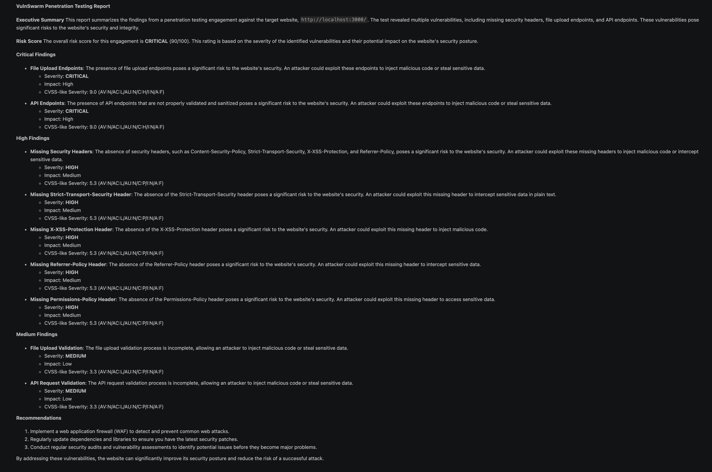

<div align="center">

```
 __   ___   _    _  _ _____      __   _   ___ __  __
 \ \ / / | | |  | \| / __\ \    / /  /_\ | _ \  \/  |
  \ V /| |_| |__| .` \__ \\ \/\/ /  / _ \|   / |\/| |
   \_/ |____|____|_|\_|___/ \_/\_/  /_/ \_\_|_\_|  |_|
```

# VulnSwarm

**Multi-Agent AI Security Testing Framework**

*AI tools are shipping vulnerable code. VulnSwarm finds it.*

[](https://python.org)
[](LICENSE)
[](https://github.com/aaronsood/VulnSwarm)
[](https://github.com/aaronsood/VulnSwarm/pulls)

</div>

---

## The Problem

Developers using Claude, Copilot, and Cursor are shipping code faster than ever. They're also shipping SQL injection, hardcoded secrets, broken auth, and XSS — faster than ever.

Most solo developers and small teams will never hire a penetration tester. A basic pen test costs $500–$2,000 and takes weeks to schedule.

**VulnSwarm is a first pass for developers who have none of that. It deploys a swarm of specialized AI agents to find and fix vulnerabilities before attackers do — in minutes, for free.**

---

## Demo

VulnSwarm scanning OWASP Juice Shop (a deliberately vulnerable web app):



**Risk score: CRITICAL (90/100).** Found in under 15 minutes on a local CPU.

---

## Why VulnSwarm

| | Junior Pen Tester | VulnSwarm |
|---|---|---|
| Cost | $500–$2,000 | Free |
| Time to results | Days–weeks | Minutes |
| Available 24/7 | ❌ | ✅ |
| Fixes included | Sometimes | Always |
| Runs locally | ❌ | ✅ |

VulnSwarm is not a replacement for professional security teams. It's a first pass for the 99% of developers who don't have one.

---

## How It Works

VulnSwarm mirrors a real penetration testing team — multiple AI agents with distinct roles that analyze, attack, defend, and report:

```
┌─────────────────────────────────────────────────────────────────┐
│                         VulnSwarm Pipeline                      │
│                                                                 │
│  Your Code/App                                                  │
│       │                                                         │
│       ▼                                                         │
│  ┌──────────┐    ┌───────────┐    ┌──────────┐    ┌─────────┐   │
│  │  Recon   │───▶│  Exploit  │───▶│ Red Team │───▶│  Blue   │   │
│  │  Agent   │    │   Agent   │    │  Agent   │    │  Team   │   │
│  │          │    │           │    │          │    │  Agent  │   │
│  │ Maps the │    │ Rates     │    │ Chains   │    │ Writes  │   │
│  │ attack   │    │ severity  │    │ attacks  │    │ the     │   │
│  │ surface  │    │ & impact  │    │ together │    │ fixes   │   │
│  └──────────┘    └───────────┘    └──────────┘    └────┬────┘   │
│                                                         │       │
│                                                         ▼       │
│                                                   ┌──────────┐  │
│                                                   │  Report  │  │
│                                                   │  Agent   │  │
│                                                   │          │  │
│                                                   │ Full pen │  │
│                                                   │ test     │  │
│                                                   │ report   │  │
│                                                   └──────────┘  │
└─────────────────────────────────────────────────────────────────┘
```

### The Agents

| Agent | Role | Thinks Like |
|-------|------|-------------|
| 🔭 **Recon Agent** | Maps attack surface, identifies entry points, fingerprints stack | Security researcher |
| 💥 **Exploit Agent** | Rates severity, assesses exploitability, chains vulnerabilities | Penetration tester |
| 🗡️ **Red Team Agent** | Finds worst-case attack paths, challenges assumptions | Adversarial attacker |
| 🛡️ **Blue Team Agent** | Writes specific code-level fixes, prioritizes remediation | Security engineer |
| 📄 **Report Agent** | Synthesizes everything into a professional pentest report | Security consultant |

---

## What VulnSwarm Finds

### Code Analysis
- 🔴 **Hardcoded secrets** — API keys, passwords, tokens, private keys
- 🔴 **SQL injection** — string concatenation, f-strings, raw queries
- 🟠 **Dangerous functions** — `eval()`, `exec()`, `os.system()`, `pickle.loads()`
- 🟠 **Unsafe deserialization** — pickle, yaml.load, XML parsers
- 🟡 **Vulnerable dependencies** — CVE scanning via pip-audit

### Web App Scanning *(localhost only)*
- 🔴 **SQL Injection** — error-based, blind, union-based
- 🟠 **XSS** — reflected, stored, DOM-based
- 🟠 **Missing security headers** — CSP, HSTS, X-Frame-Options, etc.
- 🟡 **Information disclosure** — server banners, stack traces, debug pages
- 🟡 **Path traversal** — directory traversal in file parameters

---

## Quick Start

### Installation

```bash
git clone https://github.com/aaronsood/VulnSwarm.git
cd VulnSwarm
pip install -r requirements.txt
```

### Set your API key

```bash
cp .env.example .env
# Edit .env and add your key — supports Claude, GPT, Gemini, OpenRouter, or Ollama (free/local)
```

### Run

```bash
python -m cli.main
```

Pick your provider, set your target, watch the agents work.

### Or use it in Python

```python
from vulnswarm.graph import VulnSwarm
from vulnswarm.default_config import DEFAULT_CONFIG

vs = VulnSwarm(config={
    **DEFAULT_CONFIG,
    "llm_provider": "anthropic",  # or: openai, google, openrouter, ollama
    "scan_depth": "medium",
})

# Scan a codebase
result = vs.scan(target_path="./my_app")

# Scan a local web app
result = vs.scan(target_url="http://localhost:3000")

# Scan both
result = vs.scan(target_path="./my_app", target_url="http://localhost:8000")

print(result["report"])       # Full markdown report
print(result["report_path"])  # Saved report path
```

---

## Supported LLM Providers

No lock-in. Use whatever API key you already have — or run fully local with Ollama for free.

| Provider | Models | Key |
|----------|--------|-----|
| **Anthropic** | Claude Sonnet / Haiku | `ANTHROPIC_API_KEY` |
| **OpenAI** | GPT-4o / GPT-4o-mini | `OPENAI_API_KEY` |
| **Google** | Gemini 1.5 Pro / Flash | `GOOGLE_API_KEY` |
| **OpenRouter** | Any model | `OPENROUTER_API_KEY` |
| **Ollama** | Llama 3, Qwen, Mistral, etc. | None — runs locally |

---

## Real Report Output

This is actual output from VulnSwarm scanning OWASP Juice Shop:

```markdown
**VulnSwarm Penetration Testing Report**

Risk Score: CRITICAL (90/100)

Critical Findings:
🔴 File Upload Endpoints — CVSS 9.0
   An attacker could exploit these endpoints to inject malicious code
   or steal sensitive data.

🔴 Unvalidated API Endpoints — CVSS 9.0
   API endpoints lack proper input validation and sanitization.

High Findings:
🟠 Missing Content-Security-Policy — CVSS 5.3
🟠 Missing Strict-Transport-Security — CVSS 5.3
🟠 Missing X-XSS-Protection — CVSS 5.3
🟠 Missing Referrer-Policy — CVSS 5.3
🟠 Missing Permissions-Policy — CVSS 5.3

Recommendations:
1. Implement WAF to detect and prevent common web attacks
2. Add all missing security headers
3. Validate and sanitize all file upload and API inputs
```

*Generated in ~15 minutes using llama3.2:3b on a CPU-only VPS. Larger models produce deeper findings.*

---

## Running on Free/Local Models

No API key? No problem. VulnSwarm works with Ollama for completely free local inference:

```bash
# Install Ollama and pull a model
ollama pull llama3.2:3b        # fast, good for quick scans
ollama pull qwen2.5:14b        # smarter, better findings

# Point VulnSwarm at a remote Ollama instance
export OLLAMA_HOST=http://your-vps-ip:11434
python -m cli.main
```

---

## Safety

VulnSwarm is built for **authorized testing of your own applications**.

- ✅ Web scanning is **localhost-only** by default — remote URLs are blocked
- ✅ No weaponized exploit code is generated
- ✅ All payloads are standard pen-testing probes (same class as Burp Suite / OWASP ZAP)
- ✅ `safe_mode = True` by default — no destructive operations

---

## Roadmap

- [ ] GitHub Actions integration — scan on every PR
- [ ] SARIF output for GitHub Security tab
- [ ] JavaScript/TypeScript deep analysis
- [ ] Web UI
- [ ] API endpoint fuzzing
- [ ] Authentication testing
- [ ] OWASP Top 10 full coverage checklist
- [ ] Autonomous fix PRs

---

## Contributing

Contributions are very welcome. VulnSwarm is early — there's a lot to build.

See [CONTRIBUTING.md](CONTRIBUTING.md) for guidelines.

---

## Disclaimer

VulnSwarm is designed for **security testing of systems you own or have explicit permission to test**. Unauthorized security testing is illegal. The authors accept no liability for misuse.

---

## Citation

```bibtex
@software{vulnswarm2026,
  author = {aaronsood},
  title  = {VulnSwarm: Multi-Agent AI Security Testing Framework},
  year   = {2026},
  url    = {https://github.com/aaronsood/VulnSwarm}
}
```

---

<div align="center">
<sub>Built by <a href="https://github.com/aaronsood">aaronsood</a> · Star ⭐ if VulnSwarm helped you ship more secure code</sub>
</div>